# Diagram Management

**Purpose**: Guidelines for creating, managing, and maintaining diagrams in documentation using diagram-as-code tools.

## Diagram-as-Code Philosophy

Store diagrams as code in version control rather than binary image files:

**Benefits:**

- Version control friendly (text diffs)
- Easy to update and maintain
- Consistent styling
- Searchable content
- No external tools required for viewing

**Recommended tool:**

- Mermaid (built into mdBook with preprocessor)

## Mermaid Diagrams

### Setup

Add mermaid preprocessor to `book.toml`:

```toml
[preprocessor.mermaid]
command = "mdbook-mermaid"

[output.html]
additional-css = ["mermaid-custom.css"]
```

Install preprocessor:

```bash
cargo install mdbook-mermaid
```

### Syntax

Use mermaid code blocks:

````markdown
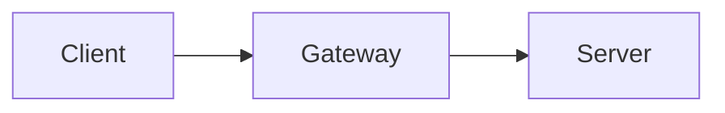
````

### Common Diagram Types

**Flowcharts:**

````markdown
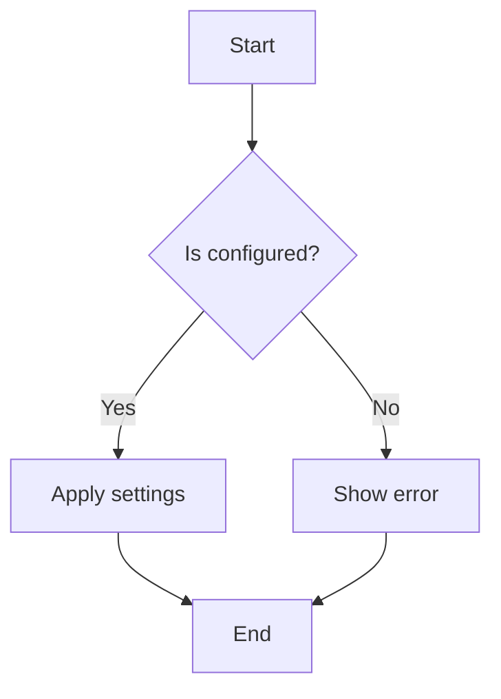
````

**Sequence diagrams:**

````markdown
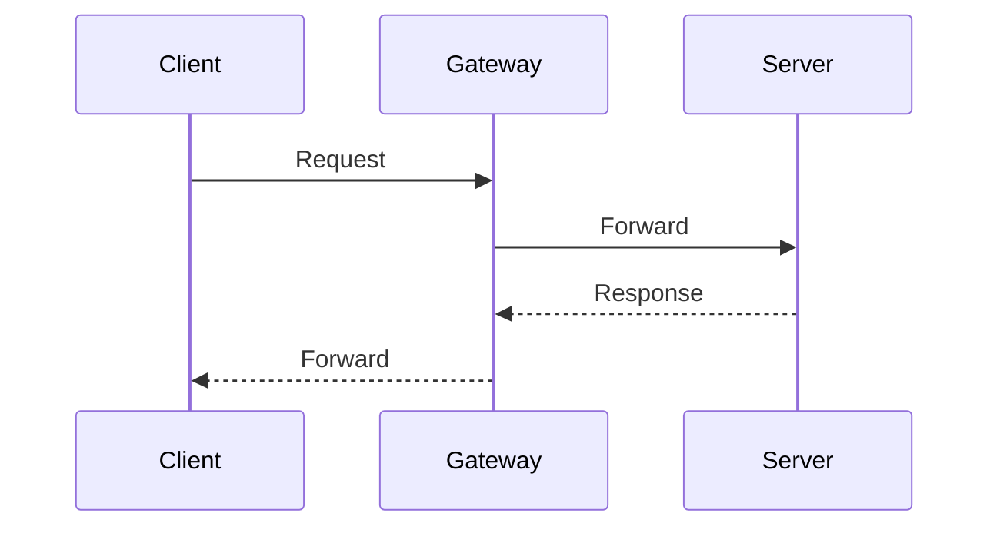
````

**Network diagrams:**

````markdown
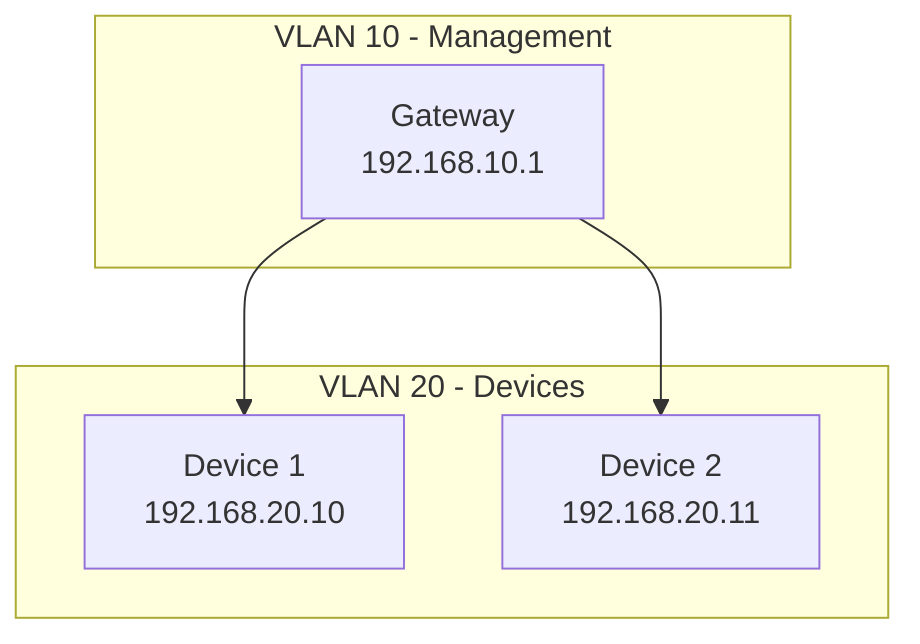
````

**State diagrams:**

````markdown
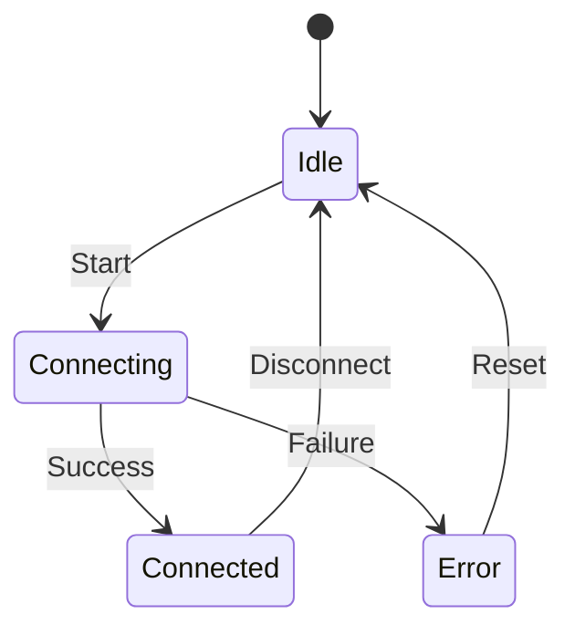
````

## Diagram Placement

### Where to Place Diagrams

**Configuration files (WHAT):**

- Architecture diagrams
- Network topology
- System design
- Component relationships

**Procedure files (HOW):**

- Workflow diagrams
- Decision trees
- Step sequences
- Troubleshooting flowcharts

**Decision files (WHY):**

- Option comparisons
- Trade-off visualizations
- Impact diagrams

### Diagram Location in File

Place diagrams near related content:

````markdown
## Network Topology

The network uses three VLANs for traffic segmentation.

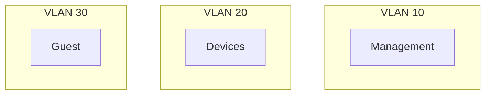
````

### VLAN Assignments

| VLAN | Purpose    | Subnet          |
| ---- | ---------- | --------------- |
| 10   | Management | 192.168.10.0/24 |

````markdown
## Diagram Conventions

### Naming and Labels

**Use descriptive labels:**

```markdown
<!-- Good -->

A[Gateway Device<br/>192.168.1.1]

<!-- Avoid -->

A[GW]
```
````

**Include IP addresses in network diagrams:**

```markdown
Gateway[Gateway<br/>192.168.10.1]
Server[Server<br/>192.168.20.10]
```

**Use consistent terminology:**

- Match terms used in documentation
- Use same names as configuration files
- Follow naming conventions from content

### Styling

**Use subgraphs for grouping:**

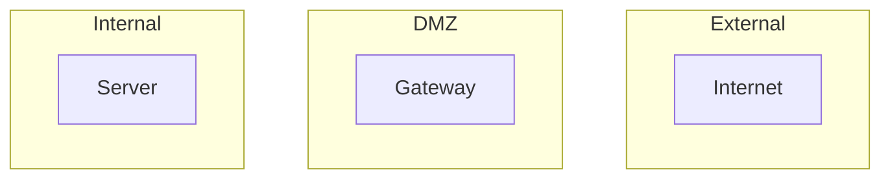

**Use colors sparingly:**

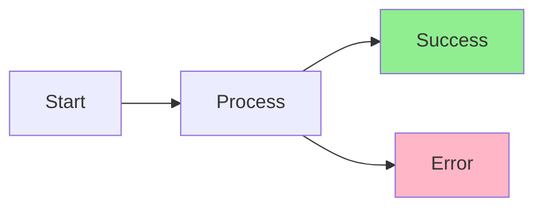

**Consistent arrow styles:**

- Solid arrows (`-->`) for primary flow
- Dashed arrows (`-.->`) for optional/fallback
- Thick arrows (`==>`) for emphasis

## Diagram Maintenance

### When to Update Diagrams

Update diagrams when:

- Network topology changes
- New components added
- Workflow changes
- Architecture evolves

### Version Control

Diagrams are code, so:

- Commit with related changes
- Include in pull requests
- Review for accuracy
- Update in same commit as related text

### Validation

Before committing:

- [ ] Diagram renders correctly (`mdbook build`)
- [ ] Labels are accurate and current
- [ ] Matches current configuration
- [ ] Terminology consistent with docs
- [ ] No outdated information

## Alternative: Image Files

When diagram-as-code isn't suitable:

### When to Use Images

- Complex diagrams from external tools
- Screenshots of UIs
- Photos of physical hardware
- Vendor-provided diagrams

### Image Guidelines

**Storage:**

- Store in `src/images/` directory
- Use descriptive filenames: `network-topology-2024-03.png`
- Include date in filename for versioned diagrams

**Format:**

- PNG for diagrams and screenshots
- SVG for vector graphics (preferred)
- JPEG only for photos

**Size:**

- Optimize images before committing
- Max width: 1200px
- Keep file size under 500KB

**Alt text:**

```markdown

```

**Captions:**

```markdown


_Figure 1: Network topology with VLAN segmentation_
```

## Mermaid Reference

### Quick Syntax Guide

**Nodes:**

- `A[Rectangle]` - Rectangle
- `A(Rounded)` - Rounded rectangle
- `A([Stadium])` - Stadium shape
- `A{Diamond}` - Diamond (decision)
- `A{{Hexagon}}` - Hexagon

**Arrows:**

- `A --> B` - Solid arrow
- `A -.-> B` - Dotted arrow
- `A ==> B` - Thick arrow
- `A -- text --> B` - Arrow with label

**Subgraphs:**

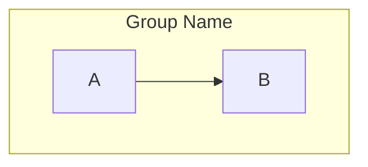

**Styling:**

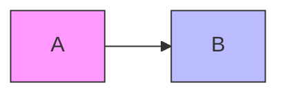

### Common Patterns

**Network topology:**

````markdown
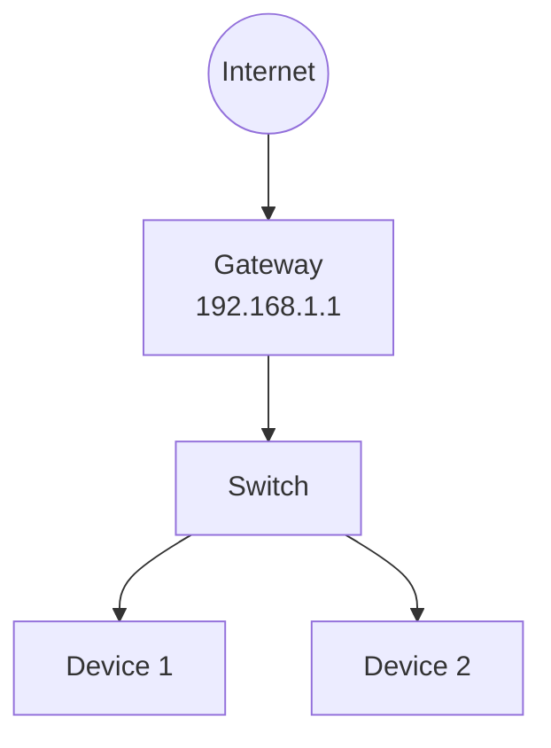
````

**Decision flow:**

````markdown
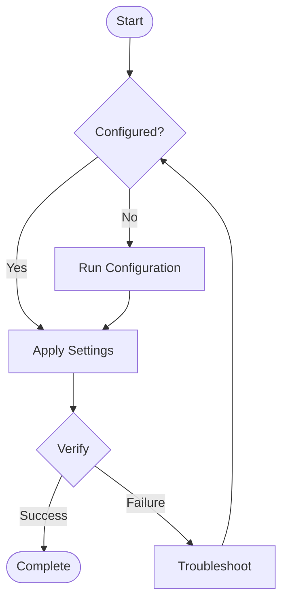
````

**Component relationships:**

````markdown
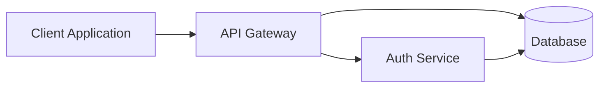
````

## Troubleshooting

### Diagram Not Rendering

**Check preprocessor installation:**

```bash
mdbook-mermaid --version
```

**Verify book.toml configuration:**

```toml
[preprocessor.mermaid]
command = "mdbook-mermaid"
```

**Check syntax:**

- Use mermaid [live editor](https://mermaid.live/)
- Validate syntax before committing

### Diagram Too Complex

**Simplify:**

- Break into multiple diagrams
- Focus on one aspect per diagram
- Use subgraphs for organization
- Remove unnecessary details

**Example - split by layer:**

Instead of one complex diagram:

- Diagram 1: Physical topology
- Diagram 2: Logical VLANs
- Diagram 3: Traffic flow

## Best Practices

1. **Keep diagrams simple** - One concept per diagram
2. **Update with code** - Diagram changes in same commit as related text
3. **Use consistent style** - Same colors, shapes, and terminology
4. **Add context** - Brief description before diagram
5. **Validate rendering** - Always build and check before committing
6. **Version complex diagrams** - Include date in filename for images
7. **Prefer code over images** - Use Mermaid when possible
8. **Document diagram source** - If using external tool, note it

## Quality Checklist

Before committing diagrams:

- [ ] Diagram renders correctly in mdBook
- [ ] Labels match current configuration
- [ ] Terminology consistent with documentation
- [ ] Appropriate diagram type for content
- [ ] Placed near related text
- [ ] Alt text provided (for images)
- [ ] File size optimized (for images)
- [ ] Syntax validated (for Mermaid)
- [ ] No outdated information
- [ ] Follows styling conventions
